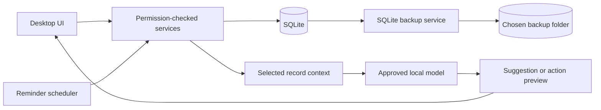

# Implementation plan: private family workspace

_Planning baseline: September 2026._

## Goal

Make Solar Forge Life Helper a simple household workspace that people control. A family can choose where its SQLite database and backups live, decide which information is shared, receive useful reminders, and optionally connect a small local language model for suggestions and approved changes. Personal records and model prompts must stay on the device or a user-approved local network endpoint.

This is a roadmap, not a claim that these capabilities exist today. Each phase should ship usable improvements without requiring the later AI phases.

## Current starting point

- The app has one SQLite database, local accounts, and profile-scoped records across twelve modules. New local installations have a first-run data and backup folder picker. Settings shows the current data folder, lets people change the saved backup folder, and can queue a verified data move for the next launch. Existing installations keep their current database; there is no backup schedule yet.
- `Storage` owns schema version 14 and upgrade snapshots. The launcher copies an older Luna database on first use. These snapshots and imports are not a user backup system.
- Docker Compose currently runs the app with `network_mode: none`, so it cannot contact an Ollama or llama.cpp server on the host or LAN. That isolation should remain the default until an explicit local-model connection is configured.
- The accounts are separate; there is no household membership, shared record policy, notification service, or AI integration.

## Preparation found in the code review

The current test baseline is 95 passing tests. The following work should happen at the indicated point rather than as one large refactor:

| When | Preparation | Reason |
| --- | --- | --- |
| Before the storage picker | Move path resolution and old-database import out of `__main__.py` into one configuration/bootstrap service. Resolve the saved choice before constructing `Storage`. | `Storage` currently creates the parent directory and initializes a fresh database on open. A missing selected drive must show a recovery screen, not look like lost family data. |
| Before a live database move | Add a single-instance or exclusive maintenance guard and an app-level operation that stops page workers, closes database connections, moves and verifies the file, then reopens it. | Pages currently own background workers while `DesktopSession` holds one `Storage` instance. A second app process or active worker could write during a move. |
| Before household sharing or AI writes | Pass an authenticated actor/context to service operations and centralize authorization. Keep existing profile filters during the transition. | Services currently accept a caller-supplied `profile_id`. That works for the local UI but is not a sufficient authorization boundary for model-proposed actions or a later LAN API. |
| Before reminders | Choose and document a time-zone policy, then migrate timed records as needed. | Calendar events and medicine times are stored as local, timezone-naive strings. Reminders must handle daylight-saving changes and a computer moving between zones. |
| Before a privacy claim for AI | Define what goes into prompts, what local logs retain, and how endpoint restrictions are tested. | The model provider will become a new data boundary even if it runs on the same machine. |

The Docker build context is now restricted to source and test inputs by `.dockerignore`, with database files and conventional `backups/` folders excluded. The storage picker should still recommend locations outside the source tree.

## Product rules for every phase

1. **Local ownership:** SQLite remains the source of truth. Keep the app fully useful without a model or an internet connection. Never silently select a cloud provider or send telemetry, prompts, or records outside the approved local endpoint.
2. **Simple defaults:** Offer a recommended data location, a separate recommended backup location, and plain explanations. Advanced settings stay available without blocking first use.
3. **Clear sharing:** A record is private until the user deliberately shares it with the household. The signed-in person's permissions apply to human and AI actions alike.
4. **Controlled model access:** The model receives only the records needed for the current request. It never receives direct database or file access. Show users what an assistant can read and change.
5. **Reliable actions:** Dates, due items, and reminder delivery are computed by application code. Model output is a suggestion or a proposed operation, validated by the app before it reaches a service.
6. **Recoverability:** Migrations, moves, backups, and restores use verified copies and have a clear recovery path. Keep the prior database until the new one has been opened and checked.

The target data flow keeps permissions and validation in the app:

## Delivery sequence

| Phase | User-visible result | Prerequisite |
| --- | --- | --- |
| 1. Storage choices | Choose and change database and backup locations in Settings. | Current app |
| 2. Backups and restore | Schedule, inspect, and restore local backups. | Phase 1 |
| 3. Household sharing | Create a household and share selected tasks and events. | Phase 2 |
| 4. Reminders | Reliable local due and scheduled notifications. | Phase 3 for shared reminders |
| 5. Local assistant, read-only | Ask questions and get suggestions from selected app data. | Phase 3 permissions; Phase 4 for reminder queries |
| 6. Approved assistant actions | Preview and approve create/update operations. | Phase 5 |
| 7. Broader sharing and polish | Extend household policies and refine the setup experience. | Evidence from earlier phases |

### Phase 1 — User-chosen storage locations

**Build:** Add a first-run setup screen and a Settings page with separate **Data location** and **Backup location** controls. Default to Qt's application data directory, while allowing an absolute directory through a native folder picker. Persist only the chosen paths in a small app configuration file outside the SQLite database, so the app can find the database on the next launch. Keep the existing environment variable as an explicit override for scripts and tests. Show the resolved paths in Settings.

**Safe move:** Validate the target directory, permissions, free space, and whether a database already exists. Explain the choice when a target contains data. Copy a live database with SQLite's backup API into a temporary file at the new location, run an integrity check, open it, then switch the configuration. Retain the source until the user chooses to remove it. Moving the database must not silently change the backup destination.

**Compose detail:** A file picker inside a container cannot select an arbitrary host folder that is not mounted. Provide a small host-side setup command or launcher that asks for host data and backup folders and generates a local Compose override with bind mounts. Keep the current named-volume default for people who do not change settings. Document how to move from the named volume without deleting it.

**Done when:** New and existing users can select each location independently; paths survive restart; missing or unwritable paths produce a recovery screen instead of a new empty database; moving an existing database preserves accounts and all module records. Test native and Compose flows with disposable data.

### Phase 2 — Backups and restore

**Build:** Use SQLite's online backup API to create timestamped snapshots in the chosen backup folder. Allow a simple schedule and a **Back up now** button. Store a manifest with schema version, creation time, file size, checksum, and app version. Retain a user-configurable number of backups. Show the last result and next scheduled run in Settings.

**Restore:** List available backups, verify integrity and schema compatibility, show what will be replaced, and take a safety snapshot of the current database before restoring. Close active database connections during the switch. On failure, reopen the original database and display a recovery path. A backup folder must be different from the live data folder; recommend a different physical drive when available.

**Done when:** A family can create, verify, and restore a backup without terminal commands; a failed backup or restore leaves the live database usable; the app warns about stale backups. Keep backups local and clearly label that SQLite files are unencrypted until an optional encryption feature is designed. Warn when a chosen folder appears to be managed by a cloud-sync service, since the operating system could then upload the backup outside the app's control.

### Phase 3 — Household membership and sharing

**Build:** Add a household entity, membership, and a minimal owner/member role model. Preserve every existing profile's data as private during migration. Let a user share selected records with the household, starting with Task List and Calendar. Keep sign-in local. Add visible **Private** and **Household** choices where records are created or edited.

**Architecture:** Centralize authorization in service methods, including list, get, create, update, and delete. Model records with an owner and a visibility rule; avoid UI-only filters. Define how shared task completion and calendar edits are attributed to a member. Expand to other modules only after the first two have passed cross-account tests. Some categories, such as journal and health records, should stay private by default and may need separate sharing rules.

**Done when:** Two local accounts can collaborate on an explicitly shared task or event, neither can read the other's private records, and existing databases migrate without exposing old data. The app explains sharing in ordinary language.

### Phase 4 — Deterministic reminders

**Build:** Introduce a reminder service for due tasks, calendar events, medicine times, and maintenance dates. Store reminder rules and delivery state in SQLite. Let users select lead time and quiet hours. Deliver local desktop notifications while the app is open; then offer an optional local background or tray process for reminders while the main window is closed.

**Reliability:** Compute due times and recurrence in app code, not in a model. Handle restarts, clock changes, time zones, missed notifications, and duplicate prevention. Household reminders honor record visibility and each member's preferences. The AI may later suggest reminder rules or wording, but the scheduler decides when to deliver them.

**Done when:** Reminders fire once at the expected local time, survive restart, respect quiet hours and permissions, and still work with AI disabled.

### Phase 5 — Optional local assistant for questions and suggestions

**Build:** Add an opt-in assistant setup screen with a local endpoint, model selector, connection test, and **Disable assistant** control. Start with a read-only experience: questions such as “What is due this week?” and suggestions drawn from explicitly selected tasks, events, or plans. Show the records used for each answer and let the user remove a category from assistant access.

**Integration:** Define a small provider interface so the app can test Ollama and llama.cpp without tying data or permissions to one server. Prefer a same-device endpoint first. A LAN endpoint is an explicit advanced choice, introduced only with an authenticated, encrypted connection and a visible host. Do not allow redirects, proxies, arbitrary internet hosts, or cloud model selection. When using Ollama, configure its local-only mode as part of setup; the app must still enforce its own endpoint restrictions. Keep Compose network isolation for users who leave the assistant off; add a separate, narrowly scoped local-model connection option rather than broad host networking.

**Model evaluation:** Test a small quantized model on representative CPU-only and modest-memory computers. Measure answer quality on household queries, latency, memory use, and whether it refuses or fabricates missing data. Pick a default only after those measurements; provide an offline model-install path and make any model download explicit. The assistant's response must never be treated as the factual source for dates or record contents.

**Done when:** The app works unchanged with the assistant disabled; enabled requests reach only the configured local endpoint; network tests show no personal data sent to an external address; the assistant cannot see another member's private records.

### Phase 6 — Approved create and update actions

**Build:** Let the assistant propose a small allowlist of operations, beginning with creating a task, updating a task, and creating a calendar event. Display a clear preview of the exact record, owner, visibility, and fields. The signed-in user approves or cancels before the app calls the same validated service methods used by the UI. Keep an audit history of approved and rejected proposals.

**Guardrails:** Validate model output against strict schemas and domain rules. Check authorization again at execution time; reject stale references and unknown fields. Limit action count per request and never expose arbitrary SQL, file operations, or unrestricted service calls. Add tests for prompt injection stored in a task or journal entry and for cross-account requests.

**Done when:** A proposed action cannot change data before approval; an approved change appears in the relevant page and audit history; malformed, unauthorized, or duplicate proposals fail safely. Later, limited automatic actions can be considered only as a separate opt-in feature with per-action controls.

### Phase 7 — Extend and simplify

Use feedback from real households to decide which additional modules need shared records, which reminders are useful, and which assistant actions save time. Consolidate setup into a short guided flow: **Choose data → Choose backups → Add family → Optional assistant**. Revisit other database connections only if SQLite has a demonstrated limitation; keep migration and backup formats portable.

If families later need the app on several devices, design a local household host with an authenticated app API and one server-owned SQLite database. Do not open the same SQLite file directly from multiple machines over a network share. Treat multi-device sync as a later project with conflict, offline, and recovery design, not a side effect of adding an LLM connection.

## First implementation slice

Start with Phase 1 in three small changes:

1. **Completed:** Add a tested settings/configuration layer that resolves the current database path without changing existing installations. Document precedence among saved choice, environment override, and default.
2. **Completed:** The first-run picker and Settings screen expose the data location and let people change the future backup folder. Selecting a backup folder is configuration only until automated backups ship. Local users can queue a move for the next launch; the app copies and verifies the database before switching its saved choice and keeps the old file.
3. Add the Compose host-folder setup path and broaden move failure recovery checks, including interrupted writes and external processes.

Phase 2 follows immediately so the backup location becomes useful. Keep each slice independently reviewable and commit changes early and often, as required by `AGENTS.md`.

## Decisions to validate with users

- Which items should a family share by default, if any? This plan starts with everything private and explicit sharing.
- Should the first backup schedule be daily, weekly, or manual? Measure how often people change data before choosing a default.
- Is the initial assistant expected to run on the same computer, or on a separately managed household computer? Same-device is the initial path; LAN connection remains optional.
- Which low-end computers should define the small-model performance target? Collect representative CPU, memory, and operating system targets before selecting a model.

## Technical references

The plan uses [Qt application data locations](https://doc.qt.io/qt-6/qstandardpaths.html) for its default path and the [SQLite online backup API](https://www.sqlite.org/backup.html) for consistent copies. [Ollama tool calling](https://docs.ollama.com/capabilities/tool-calling), [structured outputs](https://docs.ollama.com/capabilities/structured-outputs), and its [local-only and network settings](https://docs.ollama.com/faq) show one possible local-model interface. [llama.cpp's server](https://github.com/ggml-org/llama.cpp/blob/master/tools/server/README.md) is another provider to evaluate. These are candidates, not a final model or provider commitment.
